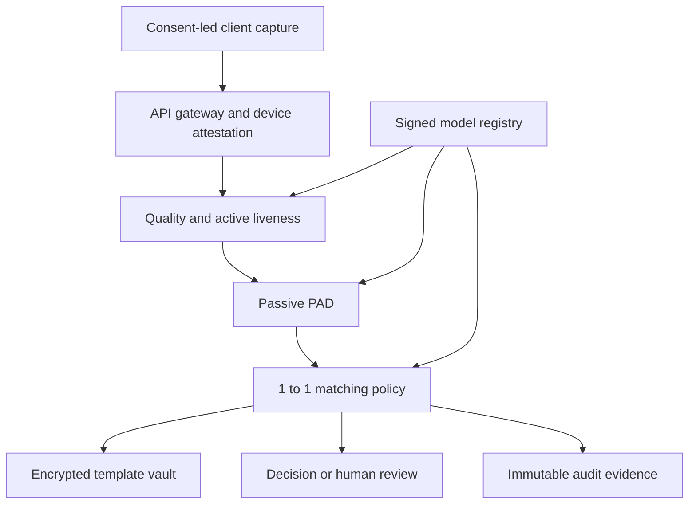

# BioCheck Verify enterprise architecture

## System boundaries

The client handles notice, consent, guided capture, challenge-response and device attestation. It never makes the final decision.

Stateless verification services run quality, PAD and embedding, then apply a versioned policy. The gateway enforces mTLS, OIDC, rate limits and request signing.

Templates use AES-256-GCM encryption and per-tenant keys. Production master keys must live in an HSM or KMS, not an application environment variable. Raw media must be separately access-controlled and deleted to a retention schedule.

The control plane separates model registry, policies, access review, audit export, monitoring and ML evaluations from customer data.

## Non-negotiable deployment controls

- V1 is only consent-led 1:1 verification; never public-space or watch-list identification.
- Record a purpose notice and consent receipt at enrolment.
- Implement tenant isolation, least-privilege RBAC, key rotation and break-glass alerting.
- Keep immutable audit exports without facial images or full template vectors.
- Train no model on customer biometric data without a separately documented agreement and lawful basis.
- Route ambiguous scores, capture failures and materially adverse workflows to a human reviewer.
